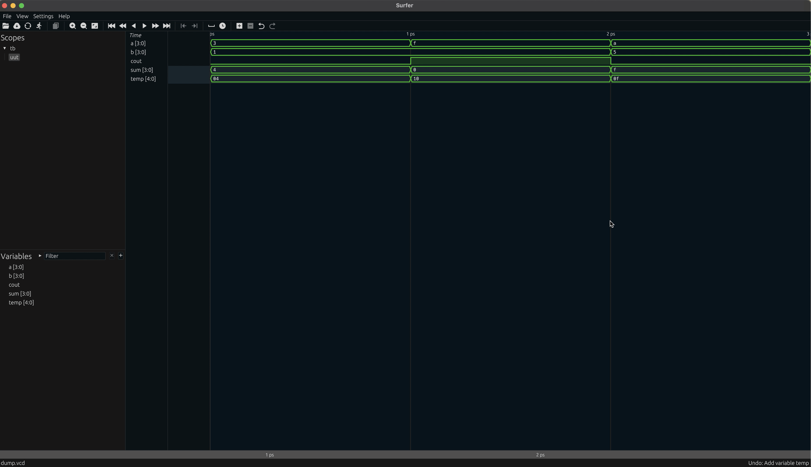
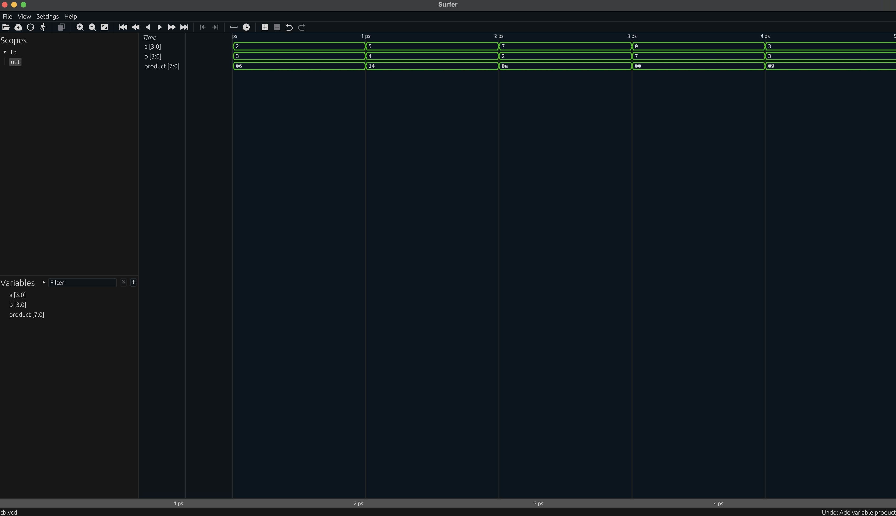
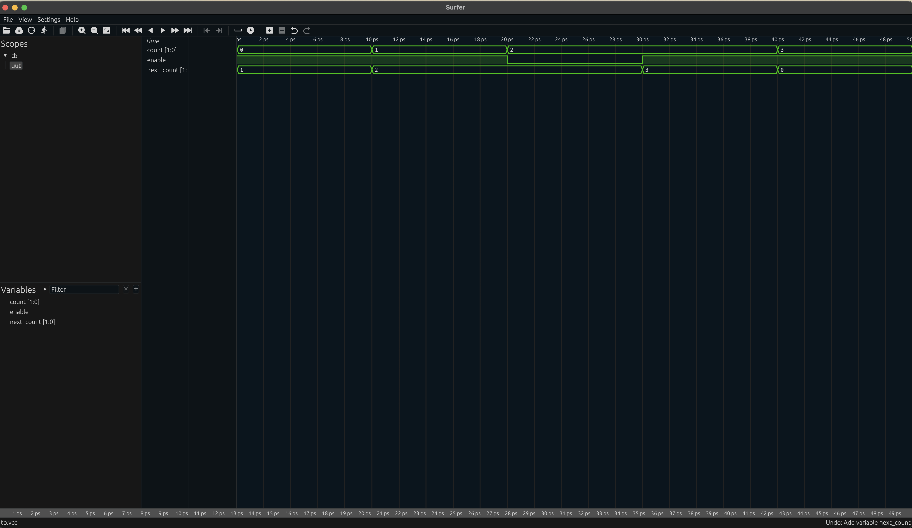
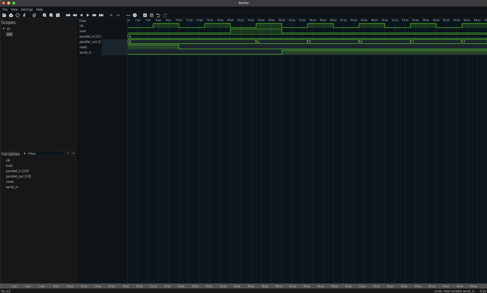

# SV Agent

LLM-powered SystemVerilog code generator with automatic verification loop.

## Setup

```bash
pip install -r requirements.txt
cp .env.example .env
```

Edit `.env` and add your OpenAI API key from https://platform.openai.com/api-keys

## Requirements

- Python 3.7+
- Verilator (for simulation)
- Surfer (for waveform viewing)

Install dependencies:

```bash
# macOS
brew install verilator
brew install surfer

# Ubuntu/Debian
apt-get install verilator
# See https://gitlab.com/surfer-project/surfer for Surfer installation

# Windows
# Install WSL2 (Windows Subsystem for Linux) first
# Then follow Ubuntu instructions above
# Or use: choco install verilator (requires Chocolatey)
# Surfer: Download from https://gitlab.com/surfer-project/surfer/-/releases
```

## Usage

```bash
python agent.py
```

Enter a hardware description and the agent will generate SystemVerilog design and testbench files, then iterate until Verilator passes or max attempts reached. On success, Surfer will open automatically to view the waveform.

## Configuration

Edit `.env`:

- `OPENAI_API_KEY` - Your OpenAI API key
- `SV_AGENT_MODEL` - Model to use (default: gpt-4o-mini)
- `SV_AGENT_MAX_ATTEMPTS` - Max iteration attempts (default: 10)

## Examples

### 4-bit Adder

Input: `4-bit adder with carry out`

https://github.com/krishkc5/sv_agent/assets/examples/4b_adder.mov



### 4-bit Multiplier

Input: `4-bit multiplier`

https://github.com/krishkc5/sv_agent/assets/examples/4b_multiplier.mov



### 2-bit Counter with Enable

Input: `2-bit counter with enable`

https://github.com/krishkc5/sv_agent/assets/examples/2b_counter_with_enable.mov



### Shift Register - Importance of Descriptive Prompts

**Failed attempt** with simple description:

Input: `4-bit shift register`

This failed because shift registers require clocks and the prompt was ambiguous about the expected behavior.

https://github.com/krishkc5/sv_agent/assets/examples/4b_shift_register_failed.mov

**Successful attempt** with detailed description:

Input: `4-bit shift register with clock, synchronous reset, serial input, and parallel load. Inputs: clk, reset (active high), load enable, serial_in (1-bit), parallel_in (4-bit). Output: 4-bit parallel_out. When reset is high, output is 0000. When load is high, register loads parallel_in. When load is low, register shifts left bringing in serial_in at LSB. Testbench should load 1010, then shift in 1s to show the shift operation clearly.`

https://github.com/krishkc5/sv_agent/assets/examples/4b_shift_register_descriptive.mov



**Key takeaway**: Be specific about sequential logic requirements (clocks, resets, behavior priorities).

### More Examples

See [example_inputs.md](example_inputs.md) for a full list of hardware designs you can try.

Quick examples:

- `8-to-1 multiplexer`
- `Population counter that counts 1s in an 8-bit value`
- `Gray code to binary converter`

## Output

- `design.sv` - Generated hardware module
- `tb.sv` - Self-checking testbench
- `*.vcd` - Waveform file (opens automatically in Surfer)
- `obj_dir/` - Verilator build artifacts
